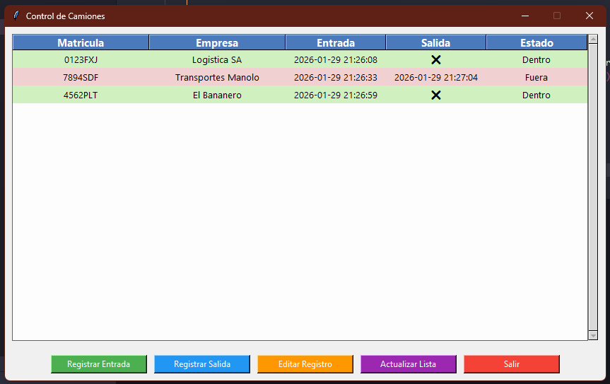

# 🚚 Control de Camiones – Sistema de Registro


Sistema de control de **entrada y salida de camiones** desarrollado en **Python**, pensado como proyecto práctico para aplicar buenas prácticas, lógica de negocio y persistencia de datos usando **SQLite**, con **interfaz gráfica** amigable para usuarios.

---

## 📌 Características principales

- 🚛 Registro de **entrada de camiones**
- ⏱️ Registro de **salida** con cálculo de tiempo
- 📋 Listado completo de movimientos
- ✏️ Edición de registros ya cerrados
- ✅ Validación de datos y fechas
- 💾 Persistencia de datos con **SQLite**
- 🧩 Código modular y fácil de mantener
- 🎨 **Interfaz gráfica (Tkinter) con tabla visual**
- ⚡ **Autocompletado de empresa por matrícula**
- ❌ **Indicador visual si el camión aún no ha salido**
- 🎨 **Filas coloreadas por estado y contenido centrado**

---

## 🛠️ Tecnologías utilizadas

- **Python 3**
- **SQLite**
- Interfaz gráfica con **Tkinter**
- Programación estructurada
- Separación de responsabilidades

---

## 📂 Estructura del proyecto

```text
control-camiones-python/
│
├── main.py                # Punto de entrada del programa (CLI)
├── gui.py                 # Interfaz gráfica del sistema
├── database.py            # Conexión y configuración de la base de datos
├── repository.py          # Operaciones CRUD y referencias de camiones
├── db/
│   └── control_camiones.db  # Base de datos SQLite
├── screenshots/
│   ├── tabla.png          # Captura de la tabla de registros
│   └── autocompletado.gif # Captura del autocompletado de empresa
└── README.md
```

---

## ▶️ Cómo ejecutar el proyecto

1. Clona el repositorio:

```bash
git clone https://github.com/Jes1997/control-camiones-python.git
```

2. Accede al directorio:

```bash
cd control-camiones-python
```

3. Ejecuta la GUI del programa:

```bash
python gui.py
```
También puedes ejecutar la versión CLI:

```bash
python main.py
```

- Requiere Python 3
- No necesita dependencias externas

## 🧠 Qué se practica con este proyecto

- Lógica de negocio aplicada a un caso real

- Gestión de bases de datos con SQLite

- Operaciones CRUD

- Validación de entradas del usuario

- Organización y limpieza del código

- Desarrollo de aplicaciones de consola y GUI

- Autocompletado de campos

- Diseño de interfaces amigables para usuario final

## 📸 Capturas

**Tabla principal con registros y colores por estado**  


**Autocompletado de empresa y registro de entrada**  


## 🚀 Posibles mejoras futuras

- Versión web (Flask o Django)

- Exportación de datos a CSV o PDF

- Sistema de usuarios

- Tests automáticos

## 📄 Licencia

Este proyecto está bajo la licencia MIT.

## 👤 Autor

Jesús García Castillo
